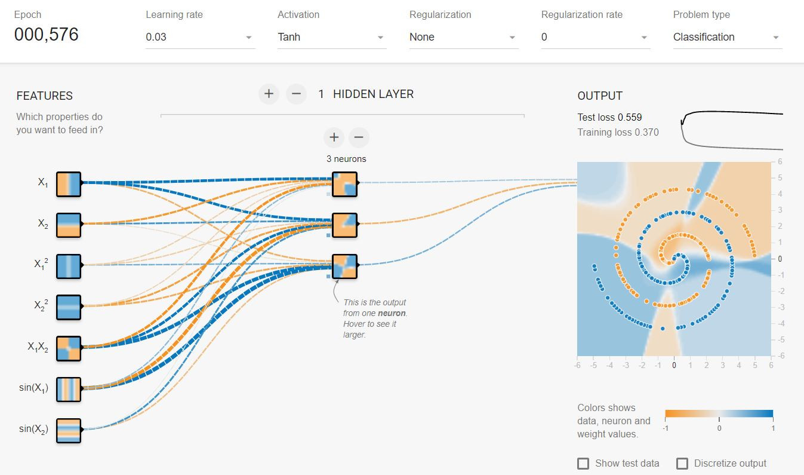

# Overview

Given the number of different kinds of neural networks, here is a cheat sheet to help choose the network to use.

# Neural Network Architecture Review

## Topology of Artificial Neural Network (ANN) and Deep Neural Networks (DNN)

Typically, ANNs and DNNs are composed of dense layers.  ANNs are typically defined by having one hidden layer and DNNs have two or more.

The topology or architecture of a neural network is defined as the type and number of layers and the type and number of neurons in each layer.  By following a small set of clear rules, one can programmatically configure a competent network architecture. Following this schema will generate a competent architecture but probably not an optimal one. Once this network is initialized, the configuration can be iteratively tuned during training using a number of ancillary algorithms including pruning, genetic optimization, etc.

Every neural network has three types of layers: *input*, *hidden*, and *output*..

### The Input Layer

Every neural network should have exactly one.  With respect to the number of neurons comprising this layer, this parameter is completely and uniquely determined once the shape of the training data is known. Specifically, the number of neurons comprising the hidden layer is equal to the number of features (columns) in the data. Some neural network configurations add one additional node for a bias term.

### The Output Layer

Every neural network has exactly one output layer. Determining its size (number of neurons) is simple; it is completely determined by the chosen model configuration.

Is your neural network going to run a classification problem (returns a discrete value) or a regression problem (returns a continuous value)?

* If the neural network is a regressor, then the output layer has a single node.

* If the neural network is a classifier, then it also has a single node unless softmax is used in which case the output layer has one node per class label in your model.

### The Hidden Layers

How many hidden layers should be in the neural network?

If your data is linearly separable, then you don't need any hidden layers at all. Of course, you don't need an neural network to resolve your data either, but it will still do the job.

There is a mountain of comentary on the question of hidden layer configuration in neural networks (see Sarle's FAQ for example). One issue is the performance difference from adding additional hidden layers. One hidden layer is sufficient for a large majority of classification and regression problems as it can approximate any (reasonable) function given enough training data.

However, there are a few difficulties with using an extremely wide, shallow network. Very wide, shallow networks are very good at memorization, but not so good at generalization. If you train the network with *every* possible input value, a super wide network could eventually memorize the corresponding output value that you want. But that is not useful because for any practical application you will not have every possible input value to train with.

Jeff Heaton (Heaton Research) provides these outlines for choosing the number of hidden layers:

**Table: Determining the Number of Hidden Layers**

| **Num   Hidden Layers** | **Result**                                                   |
| ----------------------- | ------------------------------------------------------------ |
| none                    | Only capable of representing linear separable functions or decisions. |
| 1                       | Can  approximate any function that contains a continuous mapping from one finite space to another. |
| 2                       | Can  represent an arbitrary decision boundary to arbitrary accuracy with rational activation functions and can approximate any smooth mapping to any accuracy. |
| >2                      | Additional layers can learn complex representations (sort of automatic feature engineering) for layer layers. |

Another way of looking at the power of the additional layers, is that they can learn features at various levels of abstraction. For example, with a deep convolutional neural network used to classify images, the first layer will train itself to recognize very basic things like edges, the next layer will train itself to recognize collections of edges such as shapes, the next layer will train itself to recognize collections of shapes like eyes or noses, and the next layer will learn even higher-order features like faces. Multiple layers are much better at generalizing because they learn all the intermediate features between the raw data and the high-level classification. That explains why you might use a deep network rather than a very wide but shallow network.

Why not use a very deep, very wide network? One possible answer is that the network should be as small as possible and still produce good results. As you increase the size of the network, you introducing more parameters that your network needs to learn and run the risk of increasing the chances of overfitting. If you build a very wide, very deep network, you run the chance of each layer just memorizing what you want the output to be, and you end up with a neural network that fails to generalize to new data.

In either case (wide and shallow or deep and narrow), you have many more parameters to learn and it will take longer to train. 

Deep networks already can be very computationally expensive to train, so there's a strong incentive to make them wide enough that they work well, but no wider; that is, how few neurons are sufficient in the hidden layers? Jeff Heaton gives some empirically-derived rules-of-thumb.

* The number of hidden neurons should be between the size of the input layer and the size of the output layer.
* The number of hidden neurons should be 2/3 the size of the input layer, plus the size of the output layer.
* The number of hidden neurons should be less than twice the size of the input layer.

### Optimization of the Network Configuration

Pruning describes a set of techniques to trim network size (by nodes not layers) to improve computational performance and sometimes also resolution performance. The gist of these techniques is removing nodes from the network during training by identifying those nodes which, if removed from the network, would not noticeably affect network performance (i.e., resolution of the data). 

Even without using a formal pruning technique, you can get a rough idea of which nodes are not important by looking at your weight matrix after training; the nodes with weights very close to zero--it's the nodes on either end of those weights that are often removed during pruning.) Obviously, if you use a pruning algorithm during training then begin with a network configuration that is more likely to have excess (i.e., *prunable*) nodes--in other words, when deciding on a network architecture, err on the side of more neurons, if you add a pruning step. Put another way, by applying a pruning algorithm to your network during training, you can approach optimal network configuration.

Another approach that has been studied since the 1990s is to apply a genetic algorithm to optimize the network topology.  It is still an active area of study - see the paper by Idrissi et al.

### Example

The TensorFlow playground provides the difficult spiral data model which we can attempt to solve.  First, we show underfitting. We can see that while the convergence is smooth, it is slow and the limited number of neurons in the hidden layer cannot capture all the features.

Erring to the other side, we see that while this configuration with the same number of neurons as the input layer appears to converge, we also note that the convergence is slow.  We see that the convergence is a "bumpy trip" and finally, if we look at the fifth node down, we can see that it appears to be capturing very little of the feature.

If we look at the nodes in the network below, it appears that the top node has very little influence in the model.  Yet, if we run four nodes, we get terrible convergence - that is, a bumpy ride to minimization.  However, with five nodes (even with the top one appearing to provide much in the way of feature recognition) actually captures the features in less than have of the epochs.

### References

Cross Validated, "How to choose the number of hidden layers and nodes in a feedforward neural network", March 15, 2017, https://stats.stackexchange.com/questions/181/how-to-choose-the-number-of-hidden-layers-and-nodes-in-a-feedforward-neural-netw

Cross Validated, "Why are neural networks becoming deeper, but not wider?", July 13, 2016, https://stats.stackexchange.com/questions/222883/why-are-neural-networks-becoming-deeper-but-not-wider

Heaton Research, "The Number of Hidden Layers", June 1, 2017, http://www.heatonresearch.com/2017/06/01/hidden-layers.html

Idrissi, J, et al, Genetic Algorithm for Neural Network Architecture Optimization, 2016, https://www.researchgate.net/profile/Mohammed_Amine_Janati_Idrissi/publication/309694276_Genetic_algorithm_for_neural_network_architecture_optimization/links/59f9f7dbaca272026f6ecab8/Genetic-algorithm-for-neural-network-architecture-optimization.pdf

Sarle, W.S., comp.ai.neural-nets FAQ, 2002, http://www.faqs.org/faqs/ai-faq/neural-nets/part1/preamble.html

Stathakis, D., "How many hidden layers and nodes", International Journal of Remote Sensing
Vol. 30, No. 8, 20 April 2009, 2133–2147, http://dstath.users.uth.gr/papers/IJRS2009_Stathakis.pdf

TensorFlow Playground, Accessed May 10, 2018, http://playground.tensorflow.org
